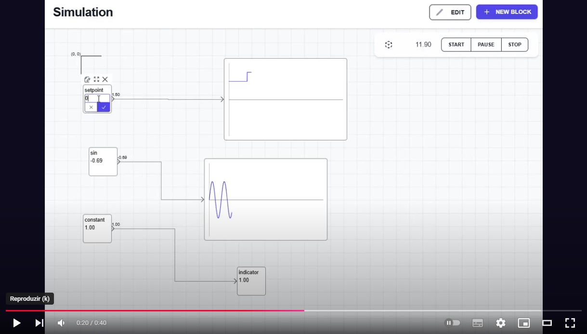

# Open Digital Twin
Now you can simulate reality ease.

Build your differential equasions in math operation blocks, add charts to visualize your output and: Tada, here we have a MatLab like but in realtime.

(Click on the image above to watch the video of simulation running)

## Run project

UI: 
  `~ docker-compose up`
